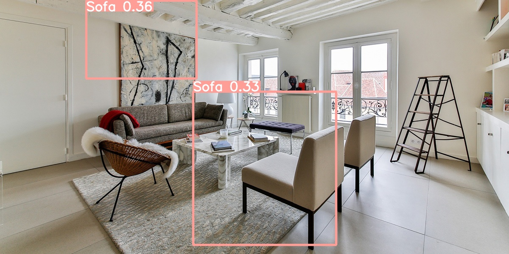
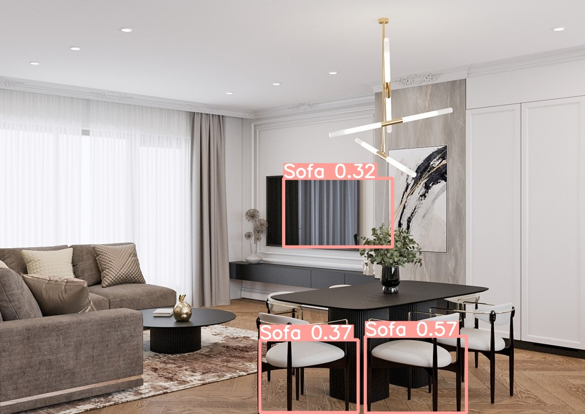
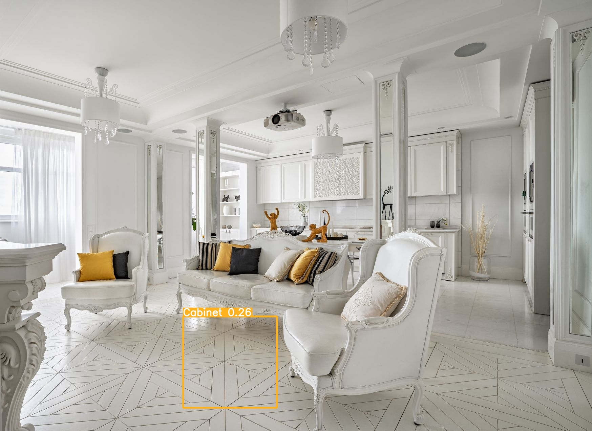
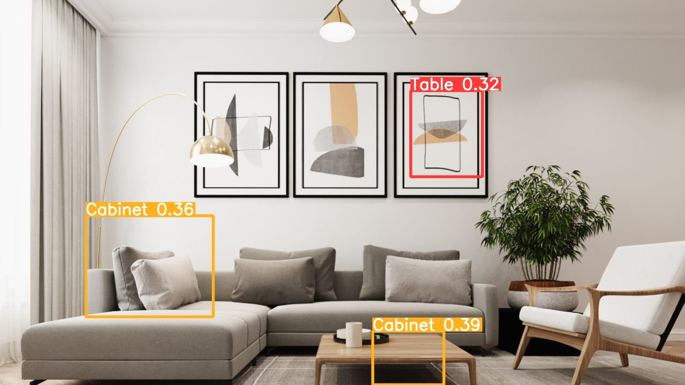

# Задача 9 - CV, синтетические данные

Для выполнения данной задачи я решил не изобретать велосипед и воспользоваться готовыми фреймворками и решениями. В частности, для создания синтетического датасета я использовал Unity и библиотеку, специально разработанную для этих целей - [Unity Perception](https://github.com/Unity-Technologies/com.unity.perception/).

Это отличное решение, позволяющее создавать синтетические данные любого уровня качества. Я выбрал не самое оптимальное решение (как выяснилось позже), но одно из самых быстрых. Я не создавал интерьер самостоятельно, а использовал альтернативный подход. Я воспользовался сценарием в библиотеке, который автоматически создавал фотографии моделей мебели с разных углов и генерировал разметку для них. Модели мебели я взял из бесплатных ассетов. Единственной сложностью в этом процессе было найти подходящие ассеты.

Затем передо мной возникла задача создать или обучить уже готовую модель на моем датасете. Для простоты и эксперимента я выбрал второй вариант и использовал модель PyTorch YOLOv5 - [YOLOv5](https://github.com/ultralytics/yolov5). Я дообучил эту модель на своих данных, предварительно преобразовав формат аннотаций из SOLO в COCO, а затем в YOLO TXT.

Пару слов о YOLOv5. Для её развёртывания лучше использовать Docker контейнер, нежели возиться с зависимостями. Для этого я использовал следующую команду:
sudo docker run --ipc=host -it --gpus all -v "$(pwd)"/datasets:/usr/src/datasets ultralytics/yolov5:latest

Процесс обучения модели не быстрый, поэтому я обучал модель 50 эпох по 15 батчей. Это, конечно, не много, но в итоге модель способна что-то распознавать. Далее приведены некоторые результаты.

Обученная нейросеть распознаёт что-то осмысленное, но требуется дополнительное дообучение:

В этом примере модель приближается к распознаванию стульев:

Однако, в некоторых случаях результаты оставляют желать лучшего:

Есть случаи, когда модель успешно распознаёт объекты, например стол:

Вот ссылка на Colab, где вы можете попробовать загрузить собственное изображение и попробовать распознать на нём мебель: [Colab Link](https://colab.research.google.com/drive/101U8h0ltcKpFlzoni2YNNTYeV7yXD3Ea?usp=sharing)

В итоге, можно сказать, что для достижения этого результата мне потребовалось много времени - 5 дней, в которые я пробовал разные подходы и остановился на этих. Но сам процесс, когда ты уже знаешь что делать, занимает примерно 5 часов работы. Я доволен результатом за 5 часов, однако, для его улучшения следует использовать реальный интерьер в Unity и провести тонкую настройку гиперпараметров при обучении модели, увеличив количество эпох.
